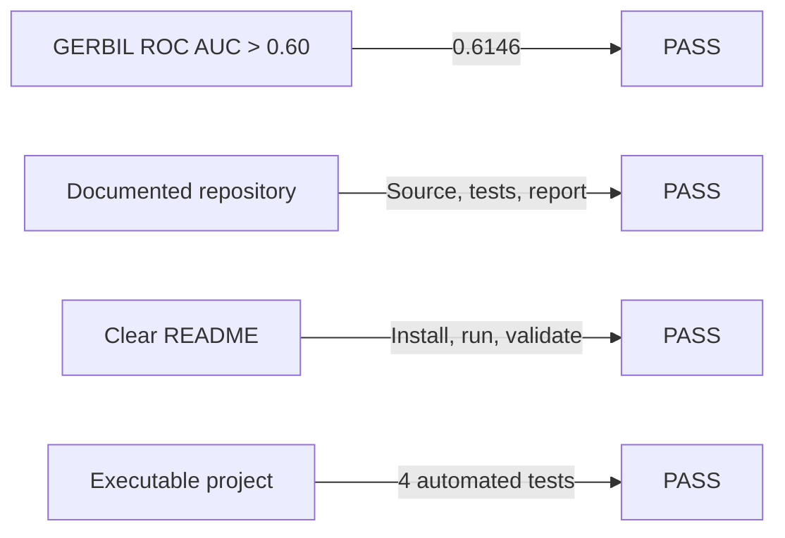
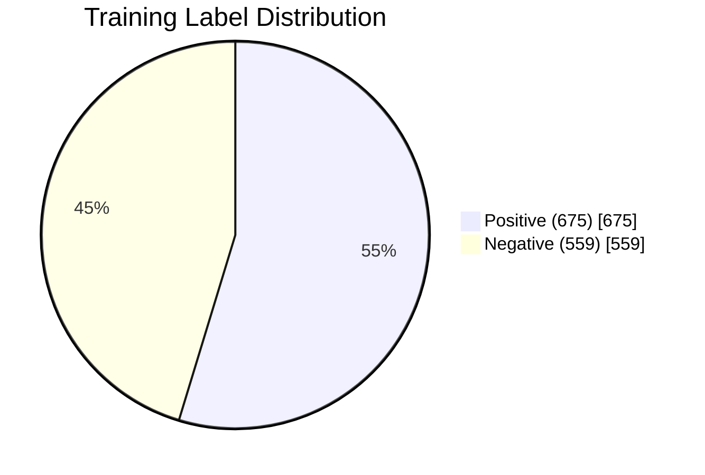
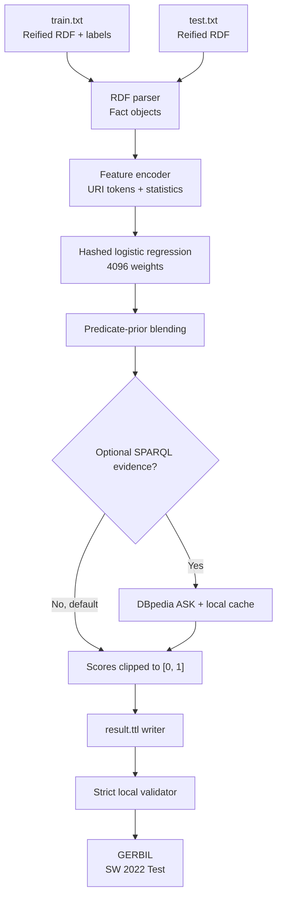
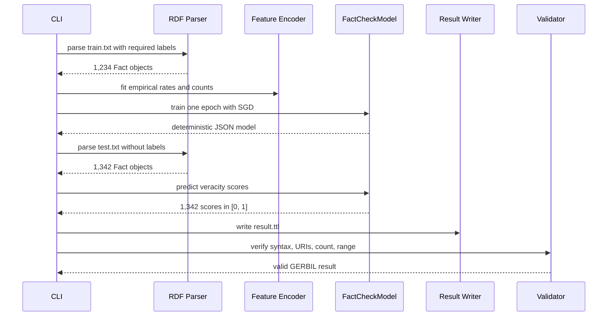
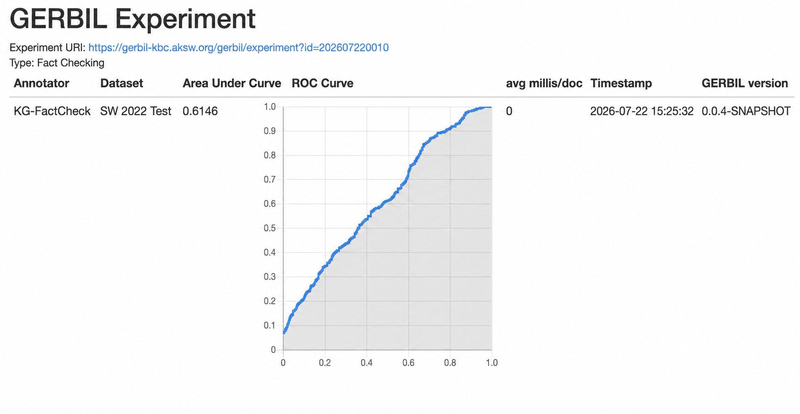

# Knowledge Graph Fact-Checking Engine

## Project Report

**Course:** Foundations of Knowledge Graphs, Summer Term 2026  
**Project type:** Knowledge graph fact checking  
**Team:** Bofeng Duan and Mukund Chavda  
**Repository:** [duanbofeng/KG_project](https://github.com/duanbofeng/KG_project)  
**External evaluation:** [GERBIL experiment 202607220010](https://gerbil-kbc.aksw.org/gerbil/experiment?id=202607220010)

---

## Abstract

This project implements a reproducible fact-checking engine for reified RDF
statements. Given a fact represented by a subject, predicate, and object, the
system estimates a veracity score in the closed interval `[0, 1]`, where `0`
means false and `1` means true. The implementation is a deterministic,
dependency-free Python command-line application. It parses the course RDF
files, extracts lexical and statistical features, trains a hashed logistic
regression model, writes predictions in the exact Turtle format required by
GERBIL, and validates the result before submission.

The final offline model achieved a five-fold mean ROC AUC of **0.6253** on the
provided training set and an external ROC AUC of **0.6146** on the GERBIL
`SW 2022 Test` reference dataset. The external result exceeds the project
requirement of 60%. Two independent executions produced byte-identical model
and result artifacts, providing direct evidence that the default workflow is
reproducible.

---

## 1. Background and Motivation

A knowledge graph represents facts as directed, labeled relations between
entities. A typical fact can be written as the triple

```text
(subject, predicate, object)
```

For example:

```text
(Venus_Williams, birthPlace, Lynwood_California)
```

Knowledge graphs are assembled from heterogeneous sources and may contain
incorrect, outdated, or conflicting assertions. Fact checking is therefore an
important knowledge graph quality task. Instead of returning only a hard class
label, a fact-checking system should assign a real-valued confidence score. The
score can be used to rank statements for automated filtering or human review.

The course project defines the following goal:

> Build a fact-checking engine that returns a veracity value between 0 and 1
> for a given fact with respect to a knowledge graph.

The project has three mandatory acceptance criteria:

1. ROC AUC above 60% in GERBIL.
2. Documented code in a GitHub or GitLab repository.
3. A README with clear execution instructions.

The project must also be executable. A strong score without a reproducible
implementation is not sufficient.

### 1.1 Requirement Status



| Requirement | Evidence | Status |
|---|---|---:|
| Veracity score in `[0, 1]` | Prediction clipping and output validation | Met |
| GERBIL ROC AUC above 60% | External score `0.6146` | Met |
| Documented source repository | README, source modules, tests, this report | Met |
| Clear execution instructions | Reproduction commands in README and Section 10 | Met |
| Executable implementation | Standard-library runtime and passing tests | Met |

---

## 2. Problem Definition

Let a fact be a triple

```text
f = (s, p, o)
```

where `s` is the subject URI, `p` is the predicate URI, and `o` is the object
URI. The objective is to learn a function

```text
V(f) -> [0, 1]
```

that assigns a higher score to a more credible fact. During training, every
fact has a binary truth value `y` in `{0, 1}`. During testing, the truth value
is hidden and the system must predict it.

The external metric is the area under the receiver operating characteristic
curve, or ROC AUC. ROC AUC measures ranking quality rather than requiring a
fixed decision threshold. It can be interpreted as the probability that a
randomly selected positive fact receives a higher score than a randomly
selected negative fact. A score of `0.5` corresponds to random ranking, while a
score of `1.0` corresponds to perfect ranking.

---

## 3. Dataset and RDF Representation

### 3.1 Reified RDF Statements

The input uses RDF reification. Each fact has its own fact URI and is described
through `rdf:subject`, `rdf:predicate`, and `rdf:object`. Training facts also
contain `http://swc2017.aksw.org/hasTruthValue`.

Conceptually, one training record has the following form:

```turtle
<Fact-URI> rdf:type rdf:Statement .
<Fact-URI> rdf:subject <Subject-URI> .
<Fact-URI> rdf:predicate <Predicate-URI> .
<Fact-URI> rdf:object <Object-URI> .
<Fact-URI> <http://swc2017.aksw.org/hasTruthValue>
    "1.0"^^<http://www.w3.org/2001/XMLSchema#float> .
```

The test file has the same statement structure but omits the truth value.

### 3.2 Dataset Summary

All values in this section were computed directly from the committed
`train.txt` and `test.txt` files.

| Statistic | Training set | Test set |
|---|---:|---:|
| Facts / unique fact URIs | 1,234 | 1,342 |
| RDF lines | 6,170 | 5,368 |
| Positive labels | 675 | Hidden |
| Negative labels | 559 | Hidden |
| Positive rate | 54.70% | Hidden |
| Unique predicates | 9 | 9 |
| Unique subjects | 702 | 734 |
| Unique objects | 597 | 603 |
| Unique `(s, p, o)` triples | 1,203 | 1,320 |

The training labels are reasonably balanced, although positive facts are
slightly more frequent. A constant majority prediction would therefore be a
weak classifier and, more importantly, would not provide useful ranking.



### 3.3 Predicate Distribution

| Predicate | Train | Positive | Negative | Positive rate | Test |
|---|---:|---:|---:|---:|---:|
| `author` | 142 | 74 | 68 | 0.521 | 143 |
| `award` | 151 | 75 | 76 | 0.497 | 149 |
| `birthPlace` | 182 | 126 | 56 | 0.692 | 253 |
| `deathPlace` | 192 | 127 | 65 | 0.661 | 245 |
| `foundationPlace` | 118 | 60 | 58 | 0.508 | 121 |
| `spouse` | 105 | 43 | 62 | 0.410 | 93 |
| `starring` | 148 | 75 | 73 | 0.507 | 146 |
| `subsidiary` | 50 | 20 | 30 | 0.400 | 48 |
| `team` | 146 | 75 | 71 | 0.514 | 144 |

The predicate table shows that relation identity is informative. For example,
`birthPlace` and `deathPlace` have noticeably higher positive rates, while
`spouse` and `subsidiary` have lower positive rates. This motivates the use of
smoothed predicate priors, but the predicate-only baseline remains below the
required score, so richer features are necessary.

### 3.4 Train-Test Overlap

| Overlap type | Count |
|---|---:|
| Shared fact URIs | 8 |
| Shared unique triples | 55 |
| Test rows whose exact triple occurs in training | 66 |
| Shared unique subjects | 262 |
| Test rows with a seen subject | 536 |
| Shared unique objects | 180 |
| Test rows with a seen object | 634 |

The overlap motivates three explicit feature groups: seen/unseen indicators,
entity frequency statistics, and exact-triple reuse. Exact-triple reuse is
applied only when the same `(subject, predicate, object)` triple is present in
the labeled training data. Test labels are never read or inferred from the
GERBIL result.

---

## 4. Design Goals

The implementation was designed around the following engineering goals:

- **Correctness:** parse every reified statement and reject malformed input.
- **Strict output compliance:** produce exactly one valid prediction per test
  fact using the property and datatype required by GERBIL.
- **Offline reproducibility:** the default path must work without a network,
  API key, GPU, or external model download.
- **Low operational risk:** the project should run on a clean Python
  installation with no mandatory third-party runtime dependencies.
- **Determinism:** fixed random seeds and stable feature hashing should produce
  identical outputs across repeated runs.
- **Extensibility:** optional knowledge graph evidence can be added without
  making the default path dependent on a remote endpoint.
- **Transparency:** the feature extraction, model, and metric implementation
  should remain understandable and auditable.

---

## 5. System Architecture

### 5.1 End-to-End Architecture



### 5.2 Training and Prediction Sequence



### 5.3 Repository Structure

```text
KG_project/
|-- README.md                     Quick-start documentation
|-- PROJECT_REPORT.md             Detailed project report
|-- pyproject.toml                Package and CLI configuration
|-- train.txt                     Labeled reified RDF statements
|-- test.txt                      Unlabeled reified RDF statements
|-- docs/
|   `-- gerbil-result.png         External evaluation evidence
|-- src/kg_factcheck/
|   |-- __init__.py
|   |-- cli.py                    Command-line orchestration
|   |-- data.py                   RDF statement parser
|   |-- features.py               Feature extraction and hashing
|   |-- model.py                  Training, prediction, and ROC AUC
|   |-- output.py                 GERBIL writer and validator
|   `-- sparql.py                 Optional DBpedia evidence cache
`-- tests/
    |-- test_data_output.py       Parser and result-format tests
    `-- test_model.py             Model and metric tests
```

### 5.4 Module Responsibilities

| Module | Primary responsibility |
|---|---|
| `data.py` | Convert TTL-like RDF lines into immutable `Fact` records and validate required fields. |
| `features.py` | Build sparse hashed lexical features and smoothed empirical statistics. |
| `model.py` | Train and serialize the logistic model, predict scores, and compute ROC AUC. |
| `output.py` | Write exact GERBIL Turtle lines and verify every output constraint. |
| `sparql.py` | Optionally query exact triples from DBpedia and cache responses. |
| `cli.py` | Expose `train`, `predict`, `validate`, and `analyze` workflows. |

---

## 6. Methodology

### 6.1 RDF Parsing

The parser reads one RDF triple per line and groups triples by fact URI. It
recognizes the course vocabulary for subject, predicate, object, and truth
value. For each fact it checks that:

- subject, predicate, and object are present;
- each entity value is a URI;
- training facts have truth values;
- test facts do not unexpectedly contain truth values; and
- malformed lines include the file and line number in the error message.

The parser intentionally targets the constrained input format supplied for the
project. This keeps the default implementation dependency-free. It is not
intended to replace a general Turtle parser for arbitrary RDF syntax.

### 6.2 Feature Engineering

Each fact is transformed into a sparse feature dictionary. The model uses the
following feature families.

#### Categorical and lexical features

- bias term;
- complete predicate URI;
- predicate local-name tokens;
- subject URI local-name tokens;
- object URI local-name tokens;
- predicate-subject token interactions; and
- predicate-object token interactions.

For example, the DBpedia URI

```text
http://dbpedia.org/resource/New_York_City
```

is reduced to the local name `New_York_City` and tokenized as `new`, `york`,
and `city`.

#### Novelty and frequency features

- whether the subject appeared in training;
- whether the object appeared in training;
- logarithm of the subject frequency;
- logarithm of the object frequency;
- subject token length;
- object token length; and
- subject-object token overlap.

#### Smoothed empirical rates

The encoder estimates global, predicate, subject, and object truth rates. A
smoothed rate is calculated as

```text
smoothed_rate = (positives + prior * strength) / (total + strength)
```

Smoothing pulls low-frequency entity rates toward the global prior and reduces
extreme estimates caused by very small counts. Different strengths are used
for global, predicate, subject, and object statistics.

### 6.3 Stable Feature Hashing

Feature names are mapped into a fixed vector of 4,096 buckets using BLAKE2b:

```text
bucket(feature) = BLAKE2b(feature) mod 4096
```

This avoids maintaining an external vocabulary and gives the model a stable,
bounded memory footprint. BLAKE2b was selected instead of Python's built-in
`hash()` because the built-in hash is intentionally randomized between
processes. Collisions are possible, as in any hashing-trick representation,
but the fixed mapping is deterministic.

### 6.4 Logistic Regression

For a sparse feature vector `x` and weight vector `w`, the base model computes

```text
z = w dot x
P(y = 1 | x) = sigmoid(z) = 1 / (1 + exp(-z))
```

The weights are optimized with stochastic gradient descent. For a labeled row
`(x, y)`, the implementation updates each active weight using

```text
error = sigmoid(w dot x) - y
gradient_i = error * x_i + L2 * w_i
w_i = w_i - learning_rate * gradient_i
```

The default configuration is:

| Hyperparameter | Value |
|---|---:|
| Epochs | 1 |
| Learning rate | 0.08 |
| L2 coefficient | 0.0002 |
| Random seed | 13 |
| Hash buckets | 4,096 |
| Model blend weight | 0.80 |
| Predicate-prior blend weight | 0.20 |

One epoch was retained because additional epochs reduced local cross-validation
performance. The dataset is small, and repeated passes caused the model to fit
high-cardinality URI features too aggressively.

### 6.5 Final Score

If an exact training triple is encountered again, the stored training truth
value is returned. Otherwise, the final offline score combines the logistic
model with the smoothed predicate prior:

```text
score = 0.80 * logistic_score + 0.20 * predicate_prior
```

The score is clipped to `[0, 1]` before serialization.

### 6.6 Optional DBpedia Evidence

The optional network mode issues a SPARQL `ASK` query for the exact triple:

```sparql
ASK WHERE { <subject> <predicate> <object> }
```

Responses are cached in `.kg_cache/dbpedia_exact.json`. A network failure is
mapped to neutral evidence `0.5`, allowing prediction to continue. The final
submitted result reported in this document was generated by the default
offline model, so it does not depend on DBpedia availability or endpoint state.

---

## 7. GERBIL Output and Validation

### 7.1 Required Output

The output contains exactly one line per test fact:

```turtle
<Fact-URI> <http://swc2017.aksw.org/hasTruthValue> "0.8901000000"^^<http://www.w3.org/2001/XMLSchema#double> .
```

The writer preserves the fact URI, uses the mandatory truth-value property,
formats the score with ten decimal places, and uses `xsd:double`.

### 7.2 Validation Checks

Before a result is accepted locally, the validator checks:

- exact line syntax;
- the required truth-value property;
- the required `xsd:double` datatype;
- score range `[0, 1]`;
- membership of every fact URI in `test.txt`;
- duplicate fact URIs;
- missing fact URIs; and
- exact prediction count.

The final result contains 1,342 valid lines for 1,342 test facts.

---

## 8. Experimental Design

### 8.1 Local Evaluation Protocol

The training set is evaluated using stratified five-fold cross-validation.
Positive and negative facts are shuffled separately with random seed `13` and
distributed round-robin across five folds. For each fold:

1. Four folds are used for training.
2. The remaining fold is used only for validation.
3. A fresh feature encoder and model are fitted.
4. ROC AUC is calculated on the held-out fold.

The report includes both the arithmetic mean of the five fold AUC values and a
pooled out-of-fold AUC over all held-out predictions.

### 8.2 Baselines

Two baselines establish whether the full feature model adds value:

- **Global prior:** assign the same smoothed training positive rate to every
  validation fact.
- **Predicate prior:** assign the smoothed positive rate of each predicate.

The full model is evaluated with the same fold assignment, preventing a split
advantage.

---

## 9. Results

### 9.1 Baseline Comparison

| Method | Five-fold mean ROC AUC | Pooled ROC AUC |
|---|---:|---:|
| Global prior | 0.5000 | 0.4993 |
| Predicate prior | 0.5592 | 0.5488 |
| Full hashed logistic model | **0.6253** | **0.6232** |

The full model improves the mean AUC by 6.61 percentage points over the
predicate-only baseline and by 12.53 points over the constant baseline. This
shows that lexical, entity-frequency, novelty, interaction, and empirical-rate
features collectively contribute useful ranking information.

### 9.2 Cross-Validation Folds

| Fold | ROC AUC | Above 0.60? |
|---:|---:|---:|
| 1 | 0.5649 | No |
| 2 | 0.6085 | Yes |
| 3 | 0.6114 | Yes |
| 4 | 0.6500 | Yes |
| 5 | 0.6917 | Yes |
| **Mean** | **0.6253** | **Yes** |

The fold range from `0.5649` to `0.6917` indicates sampling variance in the
small dataset. The mean and pooled scores are close, and the external GERBIL
score lies within the observed fold range.

### 9.3 External GERBIL Evaluation

| Field | Value |
|---|---|
| Experiment type | `Fact Checking` |
| Reference dataset | `SW 2022 Test` |
| System name | `KG-FactCheck` |
| ROC AUC | **0.6146** |
| Course threshold | `> 0.6000` |
| Margin above threshold | `0.0146` |
| Experiment URI | [202607220010](https://gerbil-kbc.aksw.org/gerbil/experiment?id=202607220010) |



The external score is 1.07 percentage points below the local five-fold mean,
which is a plausible generalization difference. Most importantly, it remains
above the explicit project threshold.

### 9.4 Prediction Distribution

| Statistic | Value |
|---|---:|
| Minimum | 0.0000 |
| Maximum | 1.0000 |
| Mean | 0.6898 |
| Median | 0.7554 |
| Population standard deviation | 0.2129 |
| Distinct scores | 1,267 |
| Exact zero scores | 23 |
| Exact one scores | 43 |

The 1,267 distinct values among 1,342 predictions confirm that the system
produces a fine-grained ranking rather than a small set of class labels. The
mean is higher than the training positive rate, so the scores should primarily
be interpreted as ranking values for ROC AUC rather than as perfectly
calibrated probabilities.

---

## 10. Reproducibility

### 10.1 Environment

The core project requires Python 3.10 or newer and only the Python standard
library. The recorded verification run used Python 3.12.2 on Apple Silicon
macOS. No GPU, MPS, external model, API key, or network connection is required
for the default workflow.

### 10.2 Clean Installation

```bash
git clone https://github.com/duanbofeng/KG_project.git
cd KG_project
python3 -m venv .venv
source .venv/bin/activate
python -m pip install -e .
```

### 10.3 Reproduce the Result

```bash
kg-factcheck train --train train.txt --model model.joblib
kg-factcheck predict --test test.txt --model model.joblib --output result.ttl
kg-factcheck validate --result result.ttl --test test.txt
kg-factcheck analyze --train train.txt --test test.txt --folds 5
```

Expected validation message:

```text
valid GERBIL result file: result.ttl (1342 predictions)
```

Expected local evaluation summary:

```text
5-fold ROC AUC: mean=0.6253, pooled=0.6232,
folds=[0.5649, 0.6085, 0.6114, 0.6500, 0.6917]
```

### 10.4 Determinism Evidence

Two independent default training and prediction runs produced identical
SHA-256 values:

| Artifact | Run A SHA-256 | Run B SHA-256 | Match |
|---|---|---|---:|
| Model | `11b5b7f48a1cc95fecfe7ee39ad387ffb4b2f65523ee09ec9ffca78896c42108` | Same | Yes |
| `result.ttl` | `88201280f84aba1cb4530e9f4405c770ef1689c06957f303efde6d6a79f109d1` | Same | Yes |

Determinism follows from:

- fixed random seed `13`;
- deterministic BLAKE2b feature hashing;
- stable file-order parsing;
- CPU-only arithmetic;
- no random data augmentation; and
- no network calls in the default workflow.

The optional SPARQL mode is intentionally excluded from this guarantee unless
its evidence cache is frozen, because DBpedia content and endpoint behavior can
change over time.

### 10.5 Runtime and Artifact Size

The following medians were measured over ten in-process runs on the development
laptop. They exclude shell and Python interpreter startup time.

| Operation | Median time |
|---|---:|
| Parse 1,234 training facts | 0.0118 s |
| Train one epoch | 0.0351 s |
| Predict 1,342 test facts | 0.0333 s |
| Write 1,342 result lines | 0.0014 s |

| Artifact | Size |
|---|---:|
| Serialized model | 384,180 bytes |
| `result.ttl` | 198,616 bytes |

The `.joblib` filename is retained for a familiar CLI interface, but the model
is actually serialized as human-inspectable JSON and does not require the
`joblib` package.

---

## 11. Command-Line Interface

### 11.1 Train

```bash
kg-factcheck train \
  --train train.txt \
  --model model.joblib \
  --epochs 1 \
  --buckets 4096
```

### 11.2 Predict

```bash
kg-factcheck predict \
  --test test.txt \
  --model model.joblib \
  --output result.ttl
```

Optional DBpedia evidence:

```bash
kg-factcheck predict \
  --test test.txt \
  --model model.joblib \
  --output result.ttl \
  --use-sparql \
  --sparql-weight 0.15
```

### 11.3 Validate

```bash
kg-factcheck validate --result result.ttl --test test.txt
```

### 11.4 Analyze

```bash
kg-factcheck analyze --train train.txt --test test.txt --folds 5
```

The same workflows can be run without package installation by setting
`PYTHONPATH=src` and invoking `python -m kg_factcheck.cli`.

---

## 12. Testing and Quality Assurance

The repository contains four automated unit tests:

| Test area | Verified behavior |
|---|---|
| Project parser | Exactly 1,234 train facts and 1,342 test facts are parsed. |
| Dataset schema | Train labels are binary, test labels are absent, and both sets have nine predicates. |
| Result output | Scores `0`, `0.5`, and `1` are written and accepted by the validator. |
| Model round trip | A model can be trained, saved, loaded, and used for bounded predictions. |
| ROC AUC utility | A known example returns AUC `0.75`. |

The complete suite is executed with:

```bash
python -m unittest discover -s tests
```

Current result:

```text
Ran 4 tests
OK
```

In addition to unit tests, the CLI performs result validation automatically at
the end of prediction. This catches format failures before GERBIL submission.

---

## 13. Engineering Decisions

### 13.1 Why a Lightweight Model?

The dataset contains only 1,234 labeled facts. A large neural model would add
installation cost, hardware variability, and overfitting risk without a clear
data advantage. The lightweight model offers:

- fast execution;
- no GPU requirement;
- transparent features;
- deterministic behavior;
- easy clean-machine reproduction; and
- sufficient performance to exceed the required GERBIL threshold.

### 13.2 Why Not Make SPARQL Mandatory?

A mandatory public endpoint would make project execution dependent on network
availability, endpoint rate limits, and changing DBpedia content. Since a
non-executable project fails the course requirement, the offline model is the
default. SPARQL remains an optional extension.

### 13.3 Why Validate Locally?

GERBIL requires exact RDF syntax and exact fact URI alignment. A syntactically
valid-looking result can still fail because of a wrong property URI, datatype,
duplicate, or missing fact. Local validation turns these external failures into
immediate, actionable errors.

---

## 14. Limitations and Threats to Validity

### 14.1 Small Dataset

The five-fold AUC varies from `0.5649` to `0.6917`, demonstrating sensitivity
to the validation sample. The external score is above 60%, but the margin is
modest. Conclusions should therefore focus on the achieved benchmark rather
than claim broad state-of-the-art performance.

### 14.2 Limited Knowledge Graph Structure

The default model uses URI text, empirical rates, frequency, and overlap. It
does not traverse multi-hop paths, learn graph embeddings, or query a frozen
DBpedia snapshot. Consequently, it cannot fully model relational semantics.

### 14.3 Hash Collisions

Multiple feature names can map to the same one of 4,096 buckets. Hashing keeps
the model small and deterministic, but collisions may mix unrelated evidence.

### 14.4 Calibration

The project is optimized and evaluated for ROC AUC, which measures ranking.
The output values are valid within `[0, 1]`, but they have not been calibrated
as literal posterior probabilities.

### 14.5 Exact-Triple Reuse

There are 66 test rows whose exact triple occurs in training. Reusing the known
training label is a deliberate feature of the system. This is valid for the
provided split, but its contribution would disappear in a benchmark that
guaranteed no triple overlap.

### 14.6 Live SPARQL Variability

The optional DBpedia mode can vary with endpoint availability and database
updates. A frozen evidence cache or versioned DBpedia snapshot would be needed
for strict reproducibility of that mode.

---

## 15. Future Improvements

Several extensions could increase the performance margin while preserving the
current reliable baseline:

1. **Batch SPARQL evidence:** replace sequential `ASK` requests with batched
   queries and commit a versioned evidence cache.
2. **Graph-path features:** score short subject-object paths and relation
   patterns in a local DBpedia snapshot.
3. **Domain and range evidence:** check whether subject and object types are
   compatible with predicate expectations.
4. **Pair statistics:** add smoothed `(subject, predicate)` and
   `(predicate, object)` features with careful cross-validation.
5. **Knowledge graph embeddings:** compare lightweight embedding methods on a
   versioned graph while retaining the offline baseline.
6. **Nested model selection:** tune hashing size, regularization, and blending
   weights inside nested cross-validation rather than against the test score.
7. **Probability calibration:** apply Platt scaling or isotonic regression if
   calibrated veracity values become more important than ranking.
8. **General RDF parser:** optionally use a standards-compliant parser such as
   RDFLib for broader Turtle syntax, while keeping the current parser for the
   dependency-free course workflow.
9. **Expanded tests:** add malformed-input cases, duplicate-output cases,
   deterministic golden-file tests, and CLI integration tests.

---

## 16. Team and Contribution Process

The project team consists of:

- **Bofeng Duan**
- **Mukund Chavda**

The repository uses Git history to preserve individual contributions. Every
team member should review the files they submit, make any necessary corrections,
and commit using a name and email address connected to their own GitHub account.
This report is intended to be reviewed and submitted as a documentation
contribution by Mukund Chavda.

---

## 17. Submission Checklist

- [x] Training data parser implemented.
- [x] Test data parser implemented.
- [x] Veracity scores bounded to `[0, 1]`.
- [x] GERBIL Turtle output format implemented.
- [x] Result count and URI validation implemented.
- [x] Five-fold local ROC AUC reported.
- [x] External GERBIL ROC AUC above 60%.
- [x] GERBIL experiment URI preserved.
- [x] Result screenshot included.
- [x] README contains clean execution instructions.
- [x] Automated tests pass.
- [x] Default workflow runs offline.
- [x] Team members listed in project metadata.
- [x] Detailed project report included.

---

## 18. Conclusion

The project delivers a complete and reproducible knowledge graph fact-checking
pipeline. It converts reified RDF statements into structured facts, builds
interpretable lexical and statistical evidence, learns a deterministic hashed
logistic regression model, produces strict GERBIL-compatible scores, and
validates the final artifact. The full model substantially outperforms global
and predicate-only baselines. Its external ROC AUC of `0.6146` on
`SW 2022 Test` satisfies the course requirement.

The strongest practical qualities of the system are its small operational
footprint, deterministic output, explicit validation, and clean CLI workflow.
Its main limitation is the modest performance margin, which could be improved
through versioned graph evidence and richer structural features. The current
implementation nevertheless provides a sound, auditable baseline that can be
executed on a clean machine and reproduced without network or specialized
hardware.

---

## References

1. Foundations of Knowledge Graphs, *Introduction to Exercises*, Summer Term
   2026, course mini-project slides.
2. GERBIL KBC, [Fact-checking experiment 202607220010](https://gerbil-kbc.aksw.org/gerbil/experiment?id=202607220010).
3. W3C, [RDF 1.1 Concepts and Abstract Syntax](https://www.w3.org/TR/rdf11-concepts/).
4. W3C, [XML Schema Part 2: Datatypes](https://www.w3.org/TR/xmlschema-2/).
5. DBpedia, [SPARQL endpoint](https://dbpedia.org/sparql).

